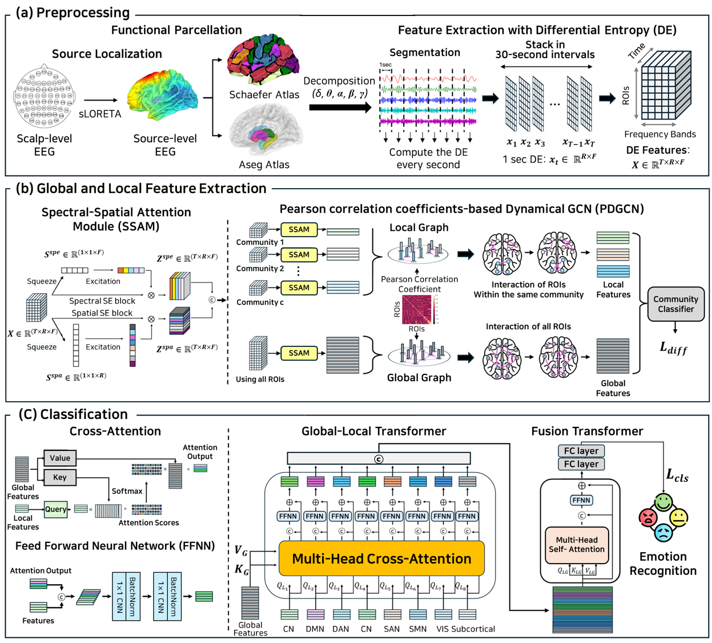

# BN-BrainTF
BN-BrainTF

Taeseong Kim, Gang Wang, Won Hee Lee

# Abstract
The human brain exhibits a complex organization into functional communities, with interconnected regions of interest (ROIs) playing a critical role in emotional processing. However, traditional transformer models for EEG-based emotion recognition often treat all ROIs equally, neglecting the crucial role of these communities. To address this limitation, we propose the brain network community-aware global-local transformer (BN-BrainTF) model. BN-BrainTF employs source localization to identify brain activity origins within functional communities derived from EEG data. The model then extracts local features specific to each community and global features capturing whole-brain context using a spectral-spatial attention module and a dynamical graph convolutional network based on functional connectivity. A global-local transformer with cross-attention integrates these features within each community, while a fusion transformer captures interactions between all communities. We evaluated BN-BrainTF on two benchmark datasets with distinct emotional classification paradigms. On the SEED dataset (three emotional states: positive, negative, and neutral), our model achieved 77.92% average accuracy across all subjects. For the SEED-IV dataset (four emotional states: happy, sad, fear, and neutral), BN-BrainTF achieved 59.41% average accuracy across all subjects. These results demonstrate the effectiveness of incorporating functional brain community structure for EEG-based emotion recognition, with consistent performance across different emotional classification tasks. The comprehensive representation of brain activity informed by functional communities provides superior emotion recognition performance compared to traditional approaches that ignore brain network organization.

# Overview

Overview of the proposed BN-BrainTF model. (a) Preprocessing stage involving source localization, functional parcellation, and differential entropy (DE) feature extraction. (b) G lobal and local feature extraction using Spectral-Spatial Attention Module (SSAM) and Pearson correlation coefficients-based Dynamical Graph Convolutional Neural Network (PDGCN). (c) Emotion recognition based on global-local transformer and fusion transformer.

# Requirements
* certifi==2022.6.15
* charset-normalizer==2.1.0
* cycler==0.11.0
* einops==0.6.1
* et-xmlfile==1.1.0
* fonttools==4.34.4
* idna==3.3
* joblib==1.1.0
* kiwisolver==1.4.4
* matplotlib==3.5.2
* mne==1.6.0
* numpy==1.21.6
* openpyxl==3.0.10
* packaging==21.3
* pandas==1.3.5
* Pillow==9.2.0
* pip==22.1.2
* pyparsing==3.0.9
* python-dateutil==2.8.2
* pytz==2022.1
* requests==2.28.1
* scikit-learn==1.0.2
* scipy==1.7.3
* setuptools==61.2.0
* six==1.16.0
* sklearn==0.0
* threadpoolctl==3.1.0
* torch==1.12.0+cu113
* torchaudio==0.12.0+cu113
* torchvision==0.13.0+cu113
* tqdm==4.66.2
* typing_extensions==4.3.0
* urllib3==1.26.11
* wheel==0.37.1
